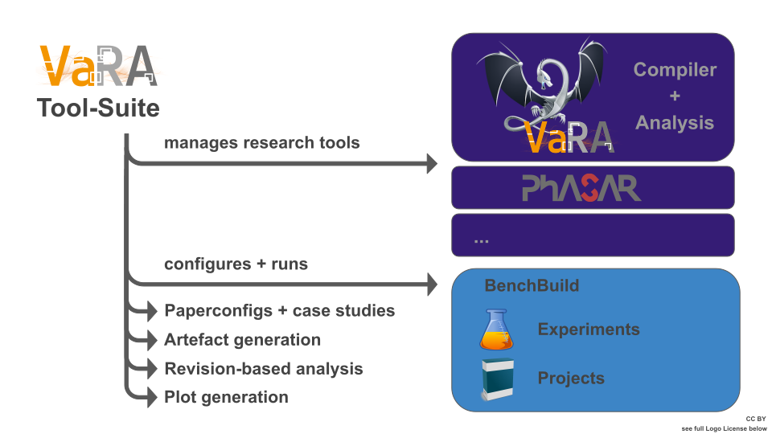

.. VaRA documentation master file, created by
   sphinx-quickstart on Tue Jan 21 15:30:01 2020.
   You can adapt this file completely to your liking, but it should at least
   contain the root `toctree` directive.

Welcome to VaRA's documentation!
===========================================

Quick overview
--------------
* :ref:`Research Tools`
* :ref:`How-Tos`
* :ref:`VaRA-TS Docs`
* :ref:`vara-ts api reference`
* `VaRA-feature API Reference`_

Research Tools
==============
VaRA-TS gives convenient access to a list of different research tools, which can be automatically installed and utilized in the provided experiments or accessed direclty for own use.

.. toctree::
   :maxdepth: 1
   :caption: List of provided research tools:

   research_tool_docs/vara/vara
   research_tool_docs/phasar/phasar

Tool-Suite Overview
===================

.. note::
   As the frist starting point, take a look at the :ref:`Tool-Suite Pipeline Overview`. The overview briefly introduces and descibes all different components and how they interact with each other.

How-Tos
=======

.. toctree::
   :maxdepth: 1

   tutorials/getting_started
   tutorials/running_experiments
   tutorials/visualizing_data
   tutorials/container_guide

* :ref:`How to add a new project to VaRA-TS`
* :ref:`How to add a new experiment to VaRA-TS`

.. toctree::
   :maxdepth: 1

   tutorials/FAQ

VaRA-TS Docs
============

.. toctree::
   :maxdepth: 1
   :caption: Contents:

   vara-ts/pipeline-overview
   vara-ts/vara-buildsetup
   vara-ts-api/tools.rst
   vara-ts/benchbuild
   vara-ts/slurm
   vara-ts/development
   vara-ts-api/vara-ts-api-reference

Indices and tables
==================

* :ref:`genindex`
* :ref:`modindex`
* :ref:`search`

Acknowledgments
===============
A very big thanks to all who supported and help to develop VaRA.
  - `Sven Apel`_, for supervision and guidance
  - `Norbert Siegmund`_, for supervision and guidance
  - Florian Niederhuber, for implementing the first version of the CommitDetection
  - Lisa Griebl, for providing the VaRA Logo. :ref:`Logo License`
  - `Sebastian Böhm`_

Logo License
------------
The logo was created using the following brushes from Axeraider70, `Galactic Brushes`_ and `Green Lotus Brushes`_, which are licensed under `CC BY-NC-ND 3.0`_.

.. _Sven Apel: https://www.se.cs.uni-saarland.de/apel/
.. _Norbert Siegmund: https://uni-weimar.de/de/medien/professuren/medieninformatik/intelligente-softwaresysteme/
.. _CC BY-NC-ND 3.0: https://creativecommons.org/licenses/by-nc-nd/3.0/
.. _Galactic Brushes: https://axeraider70.deviantart.com/art/Galactic-Brushes-60845636
.. _Green Lotus Brushes: https://axeraider70.deviantart.com/art/Green-Lotus-Brushes-52844921
.. _Sebastian Böhm: https://www.se.cs.uni-saarland.de/people/boehm.php
.. _VaRA-feature API Reference: https://se-sic.github.io/vara-feature/index.html
