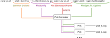

Plots
=====

Plots are used to visualize data from one or more reports.
VaRA-TS comes with its own plot abstraction that uses pyplot, seaborn and similar for plotting, which can tie plot and research data together to be automatically generated.
Here, you can find detailed information about how plots work in VaRA-TS and how to implement your own plots.
For an introduction on how to generate plots see :ref:`this guide <Visualizing Data>`.

Plot Architecture
-----------------

In the following, we describe the architecture of the VaRA-TS plot system.
The figure below gives an overview how the command line options are passed through the plot pipeline.

The command line interface for ``vara-plot`` consists of four parts:

1. *Common options:* handle functionality common to all plots, like file format
2. *Plot config:* for tuning visual appearance; specific plots may or may not respect them
3. *Plot generator name:* name of the concrete plot generator
4. *Plot- or table-specific options*: options specific to a certain plot

Plot generation is handeled by the :class:`~varats.plot.plots.PlotGenerator` classes.
The CLI selects a concrete plot generator via the passed **plot generator name** and immediately calls its ``__call__()`` function (which is implemented by the :class:`~varats.plot.plots.PlotGenerator` itself and must not be overridden by subclasses).
This function also handles the **common options** (represented by a :class:`~varats.plot.plots.CommonPlotOptions` object) that decide, for example, where to store a plot.
It also calls :func:`~varats.plot.plots.PlotGenerator.generate()`.
This function must be implemented by each concrete plot generator and is responsible for creating and returning one or more :class:`~varats.plot.plot.Plot` instances.
Each :class:`~varats.plot.plot.Plot` instance represents a single plot (or figure, or file).
Since a generator can create multiple plots, this means that a single call to ``vara-plot`` can result in multiple files.
To create the plot instances, the plot generator has access to the **plot config** (represented by a :class:`~varats.plot.plots.PlotConfig` object) and the **plot-specific** options (as ``kwargs``).
Finally, the plot generator calls the :func:`~varats.plot.plot.Plot.save()` or :func:`~varats.plot.plot.Plot.show()` function for each returned plot instance depending on the common options.

How to add a new plot in VaRA-TS
--------------------------------

To implement a new plot, you need to create at least one subclass of :class:`~varats.plot.plots.PlotGenerator` and one :class:`~varats.plot.plot.Plot`.

Each plot class must override the abstract function :func:`~varats.plot.plot.Plot.plot()` that is responsible for generating the plot.
The data for plots should be retrieved using our :ref:`data storage abstraction<Data management>`.
If your plot uses a plotting framework that is not based on pyplot, you also need to override the functions :func:`~varats.plot.plot.Plot.save()` and :func:`~varats.plot.plot.Plot.show()` so that they work for the specific plotting framework.
In some cases, it might be necessary to also override the function :func:`~varats.plot.plot.Plot.plot_file_name()` to alter how the plot's file name is generated.

For the plot generator, you need to implement the method :func:`~varats.plot.plots.PlotGenerator.generate()`.
The generator's generate function must return one or more instances of plot classes that should be generated.
There is no restriction to what plots can be instantiated, but each generator should typically restrict to generating instances of a single plot type.

Plot helper modules
-------------------

Module: plots
.............

.. automodule:: varats.plot.plots
    :members:
    :undoc-members:
    :show-inheritance:

-----

Module: plot
............

.. automodule:: varats.plot.plot
    :members:
    :undoc-members:
    :show-inheritance:

-----

Module: plot_utils
..................

.. automodule:: varats.plot.plot_utils
    :members:
    :undoc-members:
    :show-inheritance:
