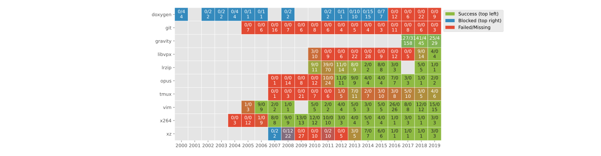

vara-plot
=========

This tool is used to generate :ref:`plots`.

.. program-output:: vara-plot -h
    :nostderr:

Available plots
---------------

Paper config overview plot
..........................

This plot gives an overview of the status of the experiment runs for the current :ref:`paper config<How to use paper configs>`.
The information in this plot is similar to what you get from :ref:`vara-cs status`.

.. autoclass:: varats.plots.paper_config_overview.PaperConfigOverviewPlot
    :members: NAME
    :undoc-members:

The plot can be obtained via::

    vara-plot --report-type <report_type> paper_config_overview_plot

Where `<report_type>` is the type of :ref:`report<Reports>` your experiments produce.
