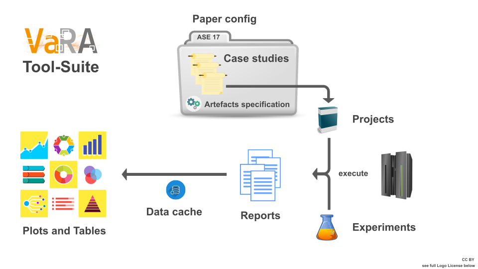

Tool-Suite Pipeline Overview
============================

.. raw:: HTML

  

    <a class="reference internal" href="../index.html#logo-license"
      CC BY
    </a>
  

* :ref:`Paper config<How to use paper configs>` groups together case studies.
* :ref:`Case studies<How to use case studies>` map revisions and configurations to projects.
* :ref:`Artefacts specification<Artefacts>` specifies which and how artefacts should be generated.
* :ref:`Projects` are wrappers around software projects.
* Automatically :ref:`execute<Running experiments with BenchBuild>` defined experiments on different projects.
* :ref:`Experiments` represent a flow of actions to evaluate a project.
* :ref:`Reports` are the output of an experiment and containt all relevant results.
* :ref:`Data cache<Data management>` is a extra caching layer to speed up data handling.
* :ref:`Plots` visualize generated data.
* :ref:`Tables` generate , e.g, latex booktabs code, to be embedded in a paper.
